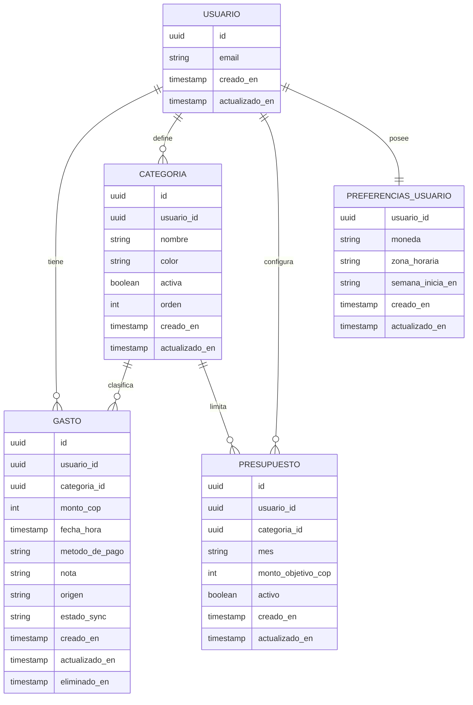

### 1. Resumen Ejecutivo
GastoLog es una PWA móvil (MVP) para registrar gastos cotidianos en menos de 15 segundos y entender, sin ser experto, en qué se va el dinero. Está pensada para adultos de 25 a 45 años que usan el celular durante el día y combinan efectivo y tarjeta. Su propuesta de valor es reducir drásticamente los “gastos que se olvidan” mediante captura rápida offline y sincronización automática al recuperar conexión, más un dashboard con métricas personales en COP. Beneficio principal: control y claridad diaria/semana/mes con el mínimo esfuerzo.

### 2. Problema y Contexto
Las personas pierden el control de sus finanzas diarias porque el registro de gastos suele ser friccional: abrir una hoja de cálculo o una app compleja, elegir demasiadas opciones, y completar muchos campos. En la práctica, los gastos pequeños (ej. $8.000 de café, $12.000 de bus, $25.000 de domicilio) se olvidan, se acumulan y al final de mes el usuario no puede explicar por qué “no le rindió” el dinero.

**Consecuencias actuales**
- **Dinero**: compras impulsivas y “fugas” pequeñas que suman una porción relevante del presupuesto mensual.
- **Tiempo**: reconstruir gastos con extractos o memoria (difícil para efectivo y micropagos).
- **Esfuerzo**: mantener una hoja de cálculo requiere disciplina y un flujo no móvil.
- **Frustración**: sensación de falta de control y culpa al no poder identificar patrones.

**Alternativas existentes y por qué son insuficientes**
- **Hojas de cálculo**: son flexibles, pero no están optimizadas para registro inmediato desde el celular; requieren abrir/editar y no ofrecen métricas sin configuración.
- **Apps “completas” de finanzas**: suelen pedir demasiada información por transacción o presuponen hábitos contables; eso eleva la fricción y reduce la adopción sostenida.
- **Apps simples tipo Wallet/Monefy**: ayudan al registro, pero pueden fallar en (a) experiencia offline-first + sync robusto para el registro diario, (b) métricas personalizadas enfocadas en reducir gastos no rastreados, y (c) una estructura de MVP enfocada en velocidad de captura y claridad semanal/mensual.
  <!-- SUPUESTO: no se integrará con bancos/automatización en el MVP; el foco es captura manual rápida. -->

**Oportunidad**
Al resolver el registro ultrarrápido y la visualización clara, se desbloquea:
- **Conciencia inmediata** de patrones (categorías y días con mayor gasto).
- **Mejores decisiones** (ajustar hábitos en la semana, no solo “al final de mes”).
- **Disciplina sostenida** gracias a un flujo que funciona offline y no exige “ponerse al día”.

### 3. Usuarios Objetivo

#### Perfil A
- **Rol**: Profesional en movimiento
- **Quién es**: Adulto (25-45) con ingresos propios. Se desplaza por la ciudad, paga con tarjeta y efectivo. Buen manejo digital, pero poco tiempo para registrar datos.
- **Objetivo principal**: Capturar gastos al momento para saber cuánto gasta por categoría y evitar sorpresas a fin de mes.
- **Frustraciones actuales**:
  - Olvida gastos pequeños si no los registra en el momento.
  - Las herramientas existentes son lentas o requieren demasiados campos.
  - No tiene visibilidad semanal; solo descubre el problema tarde.
- **Motivación para adoptar**:
  - Quiere control sin “hacer contabilidad”.
  - Necesita un registro rápido y confiable incluso sin señal.
- **Contexto de uso**:
  - Justo después de pagar en una tienda o transporte.
  - En el bus/taxi de regreso a casa.
  - En pausas cortas (fila del café, ascensor), desde el celular.

#### Perfil B
- **Rol**: Gestor de hogar y servicios
- **Quién es**: Adulto (25-45) que administra gastos del hogar (mercado, servicios, salud, transporte). Nivel digital medio-alto. Alterna pagos recurrentes y compras diarias.
- **Objetivo principal**: Entender en qué se va el dinero del hogar y cumplir presupuestos por categoría (ej. Alimentación, Servicios).
- **Frustraciones actuales**:
  - Requiere esfuerzo “sentarse” a registrar o revisar extractos.
  - No puede comparar gastos por semana/mes sin herramientas complejas.
- **Motivación para adoptar**:
  - Quiere reducir fugas y planear mejor el mes.
  - Necesita presupuestos simples por categoría.
- **Contexto de uso**:
  - Después de pagar mercado, servicios o farmacia.
  - En casa, revisando el día antes de dormir.
  - El domingo revisando la semana desde el celular.

**Usuario primario**: Perfil A (Profesional en movimiento), porque la promesa principal del producto es capturar gastos cotidianos con fricción mínima en situaciones móviles y variables (incluyendo offline).

### 4. Funcionalidades (Features)

> Notas generales de producto
- Moneda por defecto: **COP** (sin multi-moneda en MVP).
- Formato de montos: **$25.000** (miles con punto).
- Categorías de ejemplo: **Alimentación, Transporte, Entretenimiento, Salud, Hogar, Educación, Ropa, Servicios, Otros**.

#### Feature 1 — Registro rápido de gasto (flujo core)
- **User story**: Como usuario primario, quiero registrar un gasto en segundos para no olvidarlo y mantener mi historial completo.
- **Criterios de aceptación**
  1. El usuario puede crear un gasto ingresando **monto** y seleccionando **categoría** en un único formulario.
  2. La **fecha/hora** del gasto se asigna automáticamente al momento de guardado, con opción de editarla (máximo hasta 30 días atrás).
     <!-- SUPUESTO: permitir editar fecha mejora correcciones de gastos olvidados sin complejidad alta. -->
  3. El gasto se guarda **offline** cuando no hay conexión y queda marcado como **Pendiente de sincronización**.
  4. El gasto creado aparece en el **historial** inmediatamente (sin esperar sync).
  5. El tiempo promedio de registro (desde abrir formulario hasta guardar) puede ser <15s en pruebas internas (sin depender de red).
- **Información que maneja**
  - **monto_cop**: número entero (COP, sin decimales).
  - **categoría_id**: UUID (seleccionada de lista predefinida por usuario).
  - **fecha_hora**: timestamp (por defecto “ahora”).
  - **método_de_pago**: enum {Efectivo, Tarjeta, Transferencia, Otro}.
    <!-- SUPUESTO: método_de_pago es necesario porque el usuario usa efectivo y tarjeta; es campo corto y útil para análisis. -->
  - **nota**: texto opcional (máx. 140 caracteres).
  - **estado_sync**: enum {Sincronizado, Pendiente, Error}.
  - **id_local**: string/UUID local para cola offline (no visible al usuario).
- **Prioridad**: Must-have (MVP)

#### Feature 2 — Categorización de gastos
- **User story**: Como usuario, quiero asignar una categoría a cada gasto para entender patrones de consumo.
- **Criterios de aceptación**
  1. El usuario puede elegir una categoría de una lista al crear/editar un gasto.
  2. El sistema trae una lista inicial de categorías por defecto para nuevos usuarios.
  3. El usuario puede **crear** una categoría personalizada (nombre único) y usarla inmediatamente.
  4. El usuario puede **editar** el nombre de una categoría; los gastos asociados reflejan el cambio.
  5. El usuario no puede eliminar una categoría si tiene gastos asociados; en su lugar puede marcarla como **inactiva**.
     <!-- SUPUESTO: “inactiva” evita pérdida de integridad histórica. -->
- **Información que maneja**
  - **Categoría**
    - **id**: UUID
    - **usuario_id**: UUID
    - **nombre**: string (1-30)
    - **color**: string opcional (solo token/clave, no especificación de UI)
      <!-- SUPUESTO: guardar “color” permite consistencia futura de gráficos sin describir UI. -->
    - **activa**: boolean
    - **orden**: entero opcional (para ordenar lista)
    - **creada_en / actualizada_en**: timestamp
- **Prioridad**: Must-have (MVP)

#### Feature 3 — Dashboard con métricas y gráficos
- **User story**: Como usuario, quiero ver métricas y gráficos de mis gastos para saber en qué categorías y periodos gasto más.
- **Criterios de aceptación**
  1. El dashboard muestra el **total gastado** del periodo seleccionado (Hoy, Semana, Mes).
  2. Muestra una distribución por **categoría** (top categorías y porcentaje).
  3. Muestra una serie temporal simple del gasto por día (últimos 7 o 30 días según periodo).
  4. El usuario puede cambiar el **periodo** y los gráficos se recalculan con los mismos datos.
  5. Los cálculos incluyen gastos offline **pendientes**, pero los identifica como “incluye pendientes” en la lógica.
     <!-- SUPUESTO: incluir pendientes mejora utilidad inmediata; el indicador evita confusión. -->
- **Información que maneja**
  - **periodo**: enum {Hoy, Semana, Mes}
  - **agregados**
    - **total_periodo_cop**: entero
    - **gasto_por_categoria**: lista de {categoría_id, categoría_nombre, total_cop, porcentaje}
    - **gasto_por_día**: lista de {fecha (YYYY-MM-DD), total_cop}
- **Prioridad**: Must-have (MVP)

#### Feature 4 — Historial y búsqueda de gastos
- **User story**: Como usuario, quiero ver y buscar mis gastos para revisar, corregir y entender qué registré.
- **Criterios de aceptación**
  1. El historial lista gastos ordenados por **fecha_hora desc** con paginación/infinite scroll.
  2. El usuario puede filtrar por **categoría** y por **rango de fechas**.
  3. El usuario puede buscar por texto en **nota** (y opcionalmente por nombre de categoría).
     <!-- SUPUESTO: búsqueda por nota ayuda a encontrar “Uber”, “farmacia”, etc. sin complejidad alta. -->
  4. El usuario puede editar un gasto (monto, categoría, método_de_pago, fecha_hora, nota).
  5. El usuario puede eliminar un gasto; se registra en backend como eliminado (soft delete) para mantener sync.
     <!-- SUPUESTO: soft delete evita conflictos de sync y permite recuperación futura. -->
- **Información que maneja**
  - Filtros:
    - **categoría_id**: UUID opcional
    - **fecha_desde / fecha_hasta**: date opcional
    - **texto**: string opcional
  - Gasto (ver modelo de datos)
- **Prioridad**: Must-have (MVP)

#### Feature 5 — Presupuestos por categoría
- **User story**: Como usuario, quiero definir presupuestos por categoría para controlar cuánto gasto y detectar desviaciones.
- **Criterios de aceptación**
  1. El usuario puede crear/editar un presupuesto con **categoría** y **monto objetivo** en COP.
  2. El presupuesto aplica por **mes calendario** (ej. Febrero 2026).
     <!-- SUPUESTO: presupuesto mensual es el caso más común y reduce complejidad del MVP. -->
  3. El sistema calcula el **consumido** del mes por categoría y el **porcentaje** vs objetivo.
  4. Si el consumido supera el objetivo, se marca como “excedido” en la lógica de datos.
  5. El usuario puede desactivar un presupuesto sin eliminarlo (histórico).
- **Información que maneja**
  - **Presupuesto**
    - **id**: UUID
    - **usuario_id**: UUID
    - **categoría_id**: UUID
    - **mes**: string (YYYY-MM)
    - **monto_objetivo_cop**: entero
    - **activo**: boolean
    - **creado_en / actualizado_en**: timestamp
  - Cálculos:
    - **monto_consumido_cop**: entero
    - **porcentaje_consumo**: número (0-100)
    - **excedido**: boolean
- **Prioridad**: Should-have

#### Feature 6 — Autenticación de usuario
- **User story**: Como usuario, quiero iniciar sesión para que mis gastos estén seguros y disponibles en mis dispositivos.
- **Criterios de aceptación**
  1. El usuario puede registrarse e iniciar sesión con email y contraseña usando Supabase Auth.
  2. Si no está autenticado, solo puede ver pantallas públicas (Login/Registro).
  3. Las operaciones de datos (CRUD) requieren **usuario autenticado** y cumplen RLS en Supabase.
  4. El usuario puede cerrar sesión y la app elimina tokens de sesión del cliente.
  5. En caso offline, el usuario puede seguir registrando gastos si ya tenía sesión activa previamente; si no, se bloquea el acceso a datos.
     <!-- SUPUESTO: mantener sesión previa offline es clave para el uso diario; se limita a sesiones ya iniciadas. -->
- **Información que maneja**
  - **email**: string
  - **contraseña**: string (gestionada por Supabase; no se almacena en DB propia)
  - **usuario_id**: UUID (de Supabase)
  - **sesión**: tokens gestionados por SDK
- **Prioridad**: Must-have (MVP)

#### Feature 7 — Offline-first + sincronización automática
- **User story**: Como usuario, quiero registrar gastos sin conexión y que se sincronicen automáticamente para no perder información.
- **Criterios de aceptación**
  1. Cuando no hay conexión, crear/editar/eliminar gastos se guarda en un almacenamiento local (IndexedDB) como “operación pendiente”.
  2. Al recuperar conexión, la app procesa la cola y sincroniza en orden, marcando cada operación como “Sincronizado” o “Error”.
  3. Si hay conflicto (mismo gasto modificado local y remoto), el sistema aplica una política determinística: última modificación gana basada en **actualizada_en** (server vs local).
     <!-- SUPUESTO: “last-write-wins” reduce complejidad; se documenta para QA. -->
  4. El usuario puede ver un contador de pendientes (solo dato, sin especificar UI).
  5. Las fallas de sincronización se reintentan automáticamente (máx. 3 intentos por operación); luego quedan en estado “Error”.
- **Información que maneja**
  - **cola_sync** (local):
    - **id_operación**: UUID
    - **tipo**: enum {CREATE_GASTO, UPDATE_GASTO, DELETE_GASTO, CREATE_CATEGORIA, UPDATE_CATEGORIA}
    - **payload**: JSON (campos del cambio)
    - **creada_en**: timestamp
    - **intentos**: entero
    - **estado**: enum {Pendiente, Sincronizando, Sincronizado, Error}
  - Campos de **actualizada_en** en entidades para resolver conflictos.
- **Prioridad**: Must-have (MVP)

#### Feature 8 — Configuración mínima (COP y periodos)
- **User story**: Como usuario, quiero una configuración mínima para que los periodos y la moneda funcionen en mi contexto.
- **Criterios de aceptación**
  1. La moneda por defecto es COP y se usa en todos los cálculos.
  2. La app guarda el huso horario del usuario y lo usa para agrupar por día/semana/mes.
     <!-- SUPUESTO: necesario para evitar cortes de día incorrectos en métricas. -->
  3. La semana se calcula iniciando en lunes por defecto.
- **Información que maneja**
  - **PreferenciasUsuario**
    - **usuario_id**: UUID
    - **moneda**: string (default “COP”)
    - **zona_horaria**: string (IANA, ej. “America/Bogota”)
    - **semana_inicia_en**: enum {Lunes, Domingo} (default Lunes)
- **Prioridad**: Must-have (MVP, en versión mínima: valores por defecto sin UI de edición)

### 5. Arquitectura Técnica de Alto Nivel

#### Stack y componentes
- **Frontend (PWA)**: Next.js (App Router), Tailwind CSS, Recharts.
- **Backend/BaaS**: Supabase (Auth, Postgres).
- **Base de datos**: Postgres (Supabase) con Row Level Security (RLS).
- **Hosting**: Vercel o equivalente para Next.js.
  <!-- SUPUESTO: hosting en Vercel por compatibilidad directa con Next.js; puede cambiar. -->
- **PWA**: Service Worker + Cache Storage para assets; IndexedDB para cola offline y copia local.

#### Diagrama de componentes (Mermaid)
```mermaid
flowchart TB
  subgraph Cliente[PWA (Next.js)]
    UI[UI: Formularios + Rutas]
    SW[Service Worker\nCache assets]
    IDB[IndexedDB\nDatos locales + Cola sync]
    Sync[Sync Engine\n(online/offline)]
    Charts[Recharts\nMétricas]
  end

  subgraph Supabase[Supabase]
    Auth[Auth]
    API[REST/JS Client]
    DB[(Postgres + RLS)]
  end

  UI -->|crear/editar| IDB
  UI --> Charts
  SW --> UI
  Sync <--> IDB
  Sync -->|online| API
  API --> Auth
  API --> DB
  DB --> API
  API --> Sync
```

#### Modelo de datos (entidades y relaciones)
Entidades principales: **Usuario**, **Gasto**, **Categoría**, **Presupuesto**, **PreferenciasUsuario**.

**Reglas generales**
- Todos los registros están aislados por **usuario_id**.
- Se usan campos **creado_en** y **actualizado_en** para auditoría y sync.
- Soft delete con **eliminado_en** cuando aplique.

##### Diagrama ER (Mermaid)


#### Estrategia de offline/sync
- **Offline de captura** (requerido): guardar operaciones en **IndexedDB** como eventos (cola).
- **Vista inmediata**: historial y dashboard consumen primero datos locales; cuando hay red, se reconcilian con server.
- **Sync**:
  1. Detectar conexión (navigator.onLine + fallbacks por request).
  2. Procesar cola: CREATE/UPDATE/DELETE de Gastos y Categorías.
  3. Marcar operaciones como sincronizadas o en error.
- **Resolución de conflictos**:
  - Last-write-wins por `actualizado_en`.
  - Eliminaciones (soft delete) prevalecen sobre actualizaciones previas.
- **Reintentos**:
  - Máximo 3 intentos por operación (backoff simple).
- **Seguridad**:
  - En server, RLS bloquea cualquier acceso fuera de `usuario_id`.

#### Servicios externos requeridos
- Supabase (Auth + Postgres + API)
- Hosting para Next.js (Vercel u otro)
- No se requieren servicios adicionales en MVP.

### 6. Estructura de Páginas / Rutas

> Convención: rutas mobile-first, con navegación tipo tabs (Dashboard / Registrar / Historial / Presupuestos / Ajustes).
<!-- SUPUESTO: navegación por tabs simplifica acceso rápido al registro y métricas. -->

#### Página: Inicio / Root
- **Ruta**: `/`
- **Propósito**: Redirigir según sesión (logueado vs no).
- **Componentes principales**: loader; redirección.
- **Estado requerido**: sesión (Supabase).
- **Acciones disponibles**: ninguna.

#### Página: Login
- **Ruta**: `/auth/login`
- **Propósito**: Iniciar sesión.
- **Componentes principales**: formulario email/contraseña; error; link a registro.
- **Estado requerido**: ninguno.
- **Acciones disponibles**: iniciar sesión; navegar a registro.

#### Página: Registro
- **Ruta**: `/auth/registro`
- **Propósito**: Crear cuenta.
- **Componentes principales**: formulario email/contraseña; confirmación de contraseña; aceptación de términos.
  <!-- SUPUESTO: checkbox de términos es necesario legalmente; no se define el contenido. -->
- **Estado requerido**: ninguno.
- **Acciones disponibles**: crear cuenta; navegar a login.

#### Página: Dashboard
- **Ruta**: `/app/dashboard`
- **Propósito**: Ver métricas del periodo y resumen por categoría.
- **Componentes principales**: selector periodo; totales; gráficos (categoría y serie temporal).
- **Estado requerido**: gastos del periodo (local+remoto), categorías, estado de sync.
- **Acciones disponibles**: cambiar periodo; navegar a historial filtrado por categoría.

#### Página: Registrar gasto
- **Ruta**: `/app/registrar`
- **Propósito**: Crear gasto rápido.
- **Componentes principales**: input monto; selector categoría; selector método_de_pago; nota; botón guardar; (opcional) fecha/hora.
- **Estado requerido**: categorías activas; sesión; estado offline.
- **Acciones disponibles**: guardar; ir a categorías; ajustar fecha/hora.

#### Página: Historial
- **Ruta**: `/app/historial`
- **Propósito**: Revisar y buscar gastos.
- **Componentes principales**: lista; búsqueda; filtros (categoría, fechas); estado de sync por item.
- **Estado requerido**: gastos paginados; categorías.
- **Acciones disponibles**: buscar; filtrar; abrir editar; eliminar.

#### Página: Editar gasto
- **Ruta**: `/app/gastos/[id]`
- **Propósito**: Editar/eliminar gasto.
- **Componentes principales**: formulario prellenado; guardar; eliminar.
- **Estado requerido**: gasto por id; categorías.
- **Acciones disponibles**: actualizar; eliminar.

#### Página: Presupuestos
- **Ruta**: `/app/presupuestos`
- **Propósito**: Ver presupuestos del mes y consumo por categoría.
- **Componentes principales**: lista; selector mes; consumo vs objetivo.
- **Estado requerido**: presupuestos; gastos del mes; categorías.
- **Acciones disponibles**: cambiar mes; crear/editar; desactivar.

#### Página: Crear/Editar presupuesto
- **Ruta**: `/app/presupuestos/[id]` (id = `nuevo` o UUID)
- **Propósito**: Crear/editar presupuesto.
- **Componentes principales**: selector categoría; input monto objetivo; selector mes; toggle activo.
- **Estado requerido**: categorías; presupuesto si edita.
- **Acciones disponibles**: guardar; desactivar.

#### Página: Categorías
- **Ruta**: `/app/categorias`
- **Propósito**: Gestionar categorías.
- **Componentes principales**: lista; crear; editar; activar/inactivar.
- **Estado requerido**: categorías; conteo de gastos por categoría (para reglas de eliminación).
- **Acciones disponibles**: crear; editar; activar/inactivar.

#### Página: Ajustes
- **Ruta**: `/app/ajustes`
- **Propósito**: Preferencias y sesión.
- **Componentes principales**: moneda (solo lectura); zona horaria (solo lectura en MVP); contador pendientes; cerrar sesión.
- **Estado requerido**: preferencias; estado sync; sesión.
- **Acciones disponibles**: cerrar sesión; (Fase 2) editar preferencias.

#### Página: Sync / pendientes
- **Ruta**: `/app/sync`
- **Propósito**: Ver pendientes/errores de sincronización.
- **Componentes principales**: lista de operaciones; reintentar.
- **Estado requerido**: cola_sync local.
- **Acciones disponibles**: reintentar; limpiar sincronizadas.

#### Flujo de navegación entre páginas (Mermaid)
```mermaid
flowchart LR
  A[/auth/login/] -->|login ok| D[/app/dashboard/]
  B[/auth/registro/] --> A
  R[/ /] -->|sin sesión| A
  R -->|con sesión| D

  subgraph App[Área autenticada]
    D --> H[/app/historial/]
    D --> G[/app/registrar/]
    D --> P[/app/presupuestos/]
    D --> S[/app/ajustes/]
    H --> E[/app/gastos/[id]/]
    P --> PE[/app/presupuestos/[id]/]
    S --> C[/app/categorias/]
    S --> SY[/app/sync/]
    G --> C
  end
```

### 7. Flujo Principal

#### Recorrido del usuario primario (registro rápido)
Punto de entrada: el usuario abre la PWA desde el ícono instalado o el navegador y aterriza en el dashboard si ya tiene sesión iniciada.

Secuencia:
1. El usuario abre GastoLog y, si está autenticado, ve el **Dashboard** del periodo por defecto (Hoy).
2. Cuando realiza una compra, navega a **Registrar**.
3. Ingresa el **monto en COP** (ej. $12.000), selecciona **categoría** (Transporte) y **método de pago** (Efectivo o Tarjeta).
4. Opcionalmente agrega una **nota** corta (“bus”, “café”) y guarda.
5. Si está **offline**, el gasto queda local como **Pendiente**, aparece en historial y el dashboard se recalcula incluyendo pendientes.
6. Si está **online**, el gasto se guarda en Supabase y se refleja como **Sincronizado**.
7. Finalmente, el usuario confirma que el gasto quedó registrado y continúa su día.

Bifurcaciones:
- Si el usuario **ya registró gastos hoy**, al abrir la app ve el total acumulado del día y puede ir a Historial para revisar detalles.
- Si no encuentra una categoría adecuada, desde Registrar va a **Categorías**, crea una nueva, vuelve y registra.
- Si hay **errores de sync**, el usuario puede revisarlos en `/app/sync` y reintentar.

Punto de cierre: el usuario valida el registro por la presencia del gasto en historial y el cambio en totales del dashboard.

#### Flujo secundario (consulta de métricas al final de la semana)
1. El domingo el usuario abre el Dashboard y cambia el periodo a **Semana**.
2. Revisa top categorías y tendencia diaria de gasto.
3. Si detecta una categoría alta, toca la categoría para ir al historial filtrado y revisar gastos concretos.
4. (Si usa presupuestos en Fase 2) entra a Presupuestos y compara consumo del mes contra objetivo por categoría.
5. Cierra la app con una conclusión accionable para la semana siguiente.

### 8. Plan de Desarrollo por Fases

#### Fase 1 — MVP: Captura + Visualización básica
**Objetivo**: Registro rápido offline-first + dashboard básico para empezar a reducir gastos no rastreados.
- Features incluidas:
  - Autenticación (Feature 6)
  - Registro rápido (Feature 1)
  - Categorización (Feature 2)
  - Historial + edición/eliminación + búsqueda simple (Feature 4)
  - Dashboard (Feature 3)
  - Offline/sync (Feature 7)
  - Configuración mínima por defecto (Feature 8)
- Entregable esperado:
  - PWA desplegada, usable en móvil, con persistencia local, y sync básico estable.
- Estimación vibecoding (1 dev): 1–2 días.

#### Fase 2 — Control por categoría
**Objetivo**: Añadir presupuestos para aumentar valor mensual.
- Features incluidas:
  - Presupuestos por categoría (Feature 5)
  - Mejoras de sync: reintentos visibles + `/app/sync` más completa
  - Preferencias editables (semana_inicia_en)
- Entregable esperado:
  - Presupuestos funcionales con consumo vs objetivo y control del mes.
- Estimación vibecoding: 1–2 días.

#### Fase 3 — Pulido y escalabilidad
**Objetivo**: Mejorar rendimiento y preparar iteraciones.
- Features incluidas:
  - Optimización de consultas (índices, paginación, rangos)
  - Mejoras en búsqueda (si escala)
  - Telemetría mínima de producto (eventos sin PII sensible)
    <!-- SUPUESTO: telemetría ayuda a medir KPIs; implementar con logging propio o herramienta ligera. -->
- Entregable esperado:
  - App más estable, rápida y lista para nuevas funciones.
- Estimación vibecoding: 1–2 días.

### 9. Alcance del MVP

#### Qué SÍ incluye
- Registro manual de gastos en COP con: monto, categoría, fecha/hora, método de pago, nota opcional.
- Autenticación (email/contraseña) y aislamiento por usuario (RLS).
- Offline-first:
  - registro y edición offline,
  - cola de sync y sincronización automática al volver online.
- Dashboard básico:
  - total por periodo (Hoy/Semana/Mes),
  - distribución por categoría,
  - gasto por día.
- Historial con búsqueda y filtros (categoría y fechas).
- Gestión de categorías (default + personalizadas + inactivar).

#### Qué NO incluye (y por qué)
- **Multi-moneda**: diferido porque el usuario primario opera en COP exclusivamente y aumenta complejidad.
- **Integración bancaria / importación automática**: diferido; el valor principal del MVP es capturar gastos pequeños (muchos en efectivo).
- **Cuentas múltiples**: diferido; introduce contabilidad y fricción.
- **Metas de ahorro avanzadas**: diferido; primero validar hábito de registro.
- **Multiusuario/familia**: diferido; complica permisos y flujos.
- **Notificaciones inteligentes**: diferido; primero medir adopción.
- **OCR de recibos**: diferido; alto costo y no requerido para KPI principal.

### 10. KPIs y Métricas de Éxito
1. **% de gastos no rastreados**
   - Qué mide: proporción estimada de gastos diarios no registrados.
   - Línea base estimada: >60%.
   - Meta: <20% en el primer mes.
2. **Tiempo medio de registro por gasto**
   - Qué mide: segundos desde abrir Registrar hasta confirmar guardado.
   - Línea base estimada: 30–60s en soluciones friccionales.
   - Meta: <15s.
3. **Días activos por semana**
   - Qué mide: días/semana con ≥1 gasto registrado.
   - Línea base estimada: 0–1.
   - Meta: ≥4.
4. **Retención a 7 días**
   - Qué mide: % que vuelve a usar la app 7 días después del primer registro.
   - Línea base estimada: desconocida.
   - Meta: 30–40%.
   <!-- SUPUESTO: metas de retención iniciales; deben ajustarse tras datos reales. -->
5. **Tasa de sincronización exitosa**
   - Qué mide: % de operaciones offline que terminan sincronizadas sin intervención.
   - Línea base estimada: N/A.
   - Meta: ≥98%.

### 11. Riesgos y Supuestos

**Supuestos**
1. <!-- SUPUESTO: Los usuarios registrarán manualmente si el flujo es <15s y funciona offline. -->
2. <!-- SUPUESTO: El método de pago aporta valor sin incrementar fricción de forma significativa. -->
3. <!-- SUPUESTO: Presupuesto mensual por categoría cubre el caso principal del usuario objetivo. -->

**Riesgos**
1. **Riesgo**: La sincronización offline genera inconsistencias (duplicados/conflictos) y erosiona confianza.  
   - Mitigación: IDs determinísticos, soft delete, last-write-wins documentado, y página `/app/sync` para transparencia.
2. **Riesgo**: Abandono por fricción en categorización.  
   - Mitigación: categorías por defecto claras, selector rápido, y recordar última categoría usada.
   <!-- SUPUESTO: recordar última categoría reduce fricción y no agrega pantallas. -->
3. **Riesgo**: Dashboard no se percibe accionable.  
   - Mitigación: métricas simples (total + top categorías + tendencia diaria) y acceso directo al historial filtrado.
4. **Riesgo**: Configuración incorrecta de RLS expone datos entre usuarios.  
   - Mitigación: políticas RLS estrictas por `usuario_id` y pruebas automatizadas de acceso.
5. **Riesgo**: Rendimiento en móvil con muchos registros.  
   - Mitigación: paginación, rangos por fecha, índices en DB (`usuario_id`, `fecha_hora`) y cálculo incremental.
